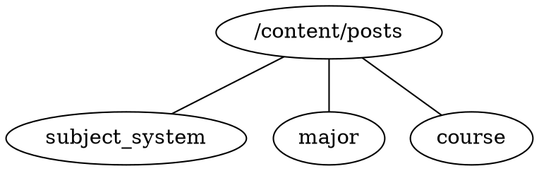

## 缘起
&emsp;&emsp;当前，互联网上的学习资源非常丰富，我们可以比较容易的搜到想要学习的课程。  
&emsp;&emsp;但是，不知你有没有这样的经历，当你开始自学一门课程一段时间之后，发现很难继续推进下去，因为这门课程还需要其他的知识作为前置条件。亦或者，当你想要学习非本专业的知识时，发现并不知道要从哪里开始。  
&emsp;&emsp;比如自学mit的公开课，虽然课件当中会告知本课程需要学习的前置课程，不过要画出完整的学科学习的路线图还是需要花费些时间的。早在2006年，《电气电子教学学报》上就有一片论文《美国MIT EECS系本科生课程设置简介》来介绍MIT EECS专业的课程路线，但是对于想要自学的人来说，去搜到这些也需要花费许多时间。  
&emsp;&emsp;再比如当前国内的公开课，可以在B站，油管或网易公开课很轻松的找到，但是如果想要完整的了解某个专业的课程设置，以及寻找相关的课件资料，就不得不自己去各个院校搜索了。  
&emsp;&emsp;**本项目希望可以有一个集中的地方，可以很方便的让想要自学某个学科的人，轻松的找到关于学科体系，课程学习路线以及相关学习资料的地方。** 由于一个人的力量是有限的，所以这里所有的资料都是由网友按照一定的规则上传的，如果你发现当前自己所学的专业简介是空页面或者课程资料暂缺时，非常欢迎你一起参与进来，贡献力量，完善学科信息。详见[如何参与](#如何参与)。  

## 如何使用
&emsp;&emsp;使用网页右上角的[搜索](../../search)按钮，便可轻松的搜到资料了。  
&emsp;&emsp;本项目可以粗略的分为三级，分别是学科体系, 专业以及课程。  

### 学科体系
&emsp;&emsp;搜索:"学科体系"，可以找到按不同体系划分的学科门类、学科以及专业。  
&emsp;&emsp;例子: 搜索"学科体系-中国", "学科体系-mit"  

### 专业
&emsp;&emsp;搜索:"专业名称"，可以找到专业对应的页面，其中会包含需要学习的课程，以及学习路线图。  
&emsp;&emsp;例子: 搜索"信息与计算科学"。  

### 课程
&emsp;&emsp;搜索:"课程名称"，可以找到课程对应的页面，其中会包含课程的不同公开课的连接，以及相关的课件连接。  
&emsp;&emsp;例子: 搜索"数学分析"  

## 如何参与

### 如何提交学科和课程的信息
&emsp;&emsp;有三种方式能让你参与到本项目中来，这里从简单到困难
1. 如果你从来没有使用过git，那么您可以通过邮件的方式给项目维护者以建议。当前项目维护者邮箱: mugglewei@gmail.com。发送邮件可以是任意格式，但是建议参考一下提交修改的格式约定，好让维护者方便的将信息填入对应的专业、课程当中。  
2. 如果你拥有一个github账号，但却不知道如何提交pull request，也没有关系。可以通过在本项目的[github主页](https://github.com/MuggleWei/learning_compass)中提交issue，来给与支持。提交issue时可以是任意格式，但是建议参考一下提交修改的格式约定，好让维护者方便的将信息填入对应的专业、课程当中。  
3. 通过github提交pull request，具体的提交格式可以参考下一节。  

### 提交的格式
* 由于本项目只是学科体系指南，所以当涉及学习资料时，只需填入链接和说明即可。不建议直接上传任何的视频、图片甚至教材到本项目当中来。  
* 本项目的结构如下图所示
  * /content/posts: 为所有节点的根目录
  * subject_system: 学科体系介绍，当中包含了不同的专业目录及关系图；例如[学科体系-中国](../subject_system/china)
  * major: 学科专业介绍，当中包含此专业的基础课程和专业课程目录，以及课程之间的依赖关系；例如[信息与计算科学](../major/信息与计算科学)等
  * course: 课程介绍，当中可包含不同学校的公开课视频链接，课件链接等; 例如[数学分析](../course/数学分析)

* 插入专业/课程时，不建议手动插入，可以通过以下角边，自动生成预设格式
  * 生成专业
  ```bash
  python new_major.py ${专业名称}
  ```
  * 生成课程
  ```bash
  python new_course.py ${课程名称}
  ```
* 本项目中的课程依赖图以及学科关系图，全部使用dot描述，比如上面生成专业之后，可以在课程依赖关系graphviz当中，直接写dot即可
* 预览: 当在本地修改好之后，想要预览最终的效果，可以安装hugo，然后运行run.sh(windows用户运行run.bat)，之后打开游览器，输入[http://127.0.0.1:8080/learning_compass/](http://127.0.0.1:8080/learning_compass/) 即可在本地游览效果。  
* 项目中的链接跳转：由于Github Pages的URL不一定一样，使用绝对地址在项目中跳转会有问题，所以建议在专业页面引用课程页面时，使用相对目录。  