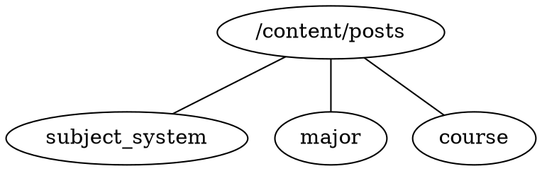

## 这个指南在做什么
当一个自学者开始自学一个技能/课程/学科时，通常会遇到这么几个事情
1. 寻找课程的学习资料: 包括公开课视频，课程用书以及习题集等，要去哪里找？  
2. 前置课程: 课程之间存在先后序关系，学习某个课程之前，需要预先掌握什么知识？  
3. 学科的路线图: 学科会包含一系列课程，这些课程之前的关系图是怎么样的？  

简单来说，本指南提供了一个聚合的地方，方便的查询学科学科体系，课程学习路线以及相关学习资料。也就是要解决上面所说的三个问题。  

## 如何使用
点击网页右上角的[搜索](../../search)按钮，便可轻松的搜到资料  
* [搜索](../../search) 专业: "[信息与计算科学](../major/信息与计算科学)", "[数学与应用数学](../major/数学与应用数学)", "[EECS](../major/eecs)"
* [搜索](../../search) 课程: "[数学分析](../course/数学分析)", "[高等代数](../course/高等代数)", "[复变函数](../course/复变函数)", "[常微分方程](../course/常微分方程)"
* [搜索](../../search) 体系: "[学科体系-中国](../subject_system/china)"

## 信息不全的问题
&emsp;&emsp;这里所有的资料都是由网友按照一定的规则上传的，如果你发现当前自己所学的专业简介是空页面或者课程资料暂缺时，非常欢迎你一起参与进来，贡献力量，完善学科信息。详见[如何参与](#如何参与)。  

## 如何参与

### 如何提交学科和课程的信息
&emsp;&emsp;有三种方式能让你参与到本项目中来，这里按使用者的难易程度从难到易列出
1. 如果你知道如何使用github的pull request，那么可以通过直接向[本项目](https://github.com/MuggleWei/learning_compass)提交pull request提交信息，具体的提交格式可以参考下一节。  
2. 如果你拥有一个github账号，但却不知道如何提交pull request，也没有关系。可以通过在向本项目提交[issue](https://github.com/MuggleWei/learning_compass/issues)的方式来给与支持。提交issue时可以是任意格式，但是建议参考一下提交修改的格式约定，好让维护者方便的将信息填入对应的专业、课程当中。  
3. 如果你从来没有使用过git，那么您可以通过邮件的方式给项目维护者以建议。当前项目维护者邮箱: mugglewei@gmail.com。发送邮件可以是任意文本格式，但是建议参考一下提交修改的格式约定，好让维护者方便的将信息填入对应的专业、课程当中。  

### 提交的格式
* 由于本项目是学科自学指南，所以当涉及学习资料时，只需填入链接和说明即可。不建议直接上传任何的视频、图片甚至教材到本项目当中来。  
* 本项目的结构如下图所示
  * /content/posts: 为所有节点的根目录
  * subject_system: 学科体系介绍，当中包含了不同的专业目录及关系图；例如[学科体系-中国](../subject_system/china)
  * major: 学科专业介绍，当中包含此专业的基础课程和专业课程目录，以及课程之间的依赖关系；例如[信息与计算科学](../major/信息与计算科学)等
  * course: 课程介绍，当中可包含不同学校的公开课视频链接，课件链接等; 例如[数学分析](../course/数学分析)  



* 插入专业/课程时，不建议手动插入，可以通过项目根目录中的两个python脚本，自动生成预设格式
  * 生成专业
  ```bash
  python new_major.py ${专业名称}
  ```
  * 生成课程
  ```bash
  python new_course.py ${课程名称}
  ```
* 本项目中的课程依赖图以及学科关系图，全部使用 [dot语言](https://graphviz.org/doc/info/lang.html) 描述，比如上面生成专业之后，可以找到graphviz代码块，直接编写即可
* 预览: 当在本地修改好之后，想要预览最终的效果，可以安装hugo，然后运行run.sh(windows用户运行run.bat)，之后打开游览器，输入[http://127.0.0.1:8080/learning_compass/](http://127.0.0.1:8080/learning_compass/) 即可在本地游览效果。如果只是游览单页，可以在vscode中安装好markdown和graphviz的插件就可以了。  
* 项目中的链接跳转：由于Github Pages的URL不一定一样，使用绝对地址在项目中跳转会有问题，所以建议在专业页面引用课程页面时，使用相对目录。  