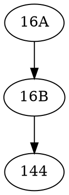

## 学科编码
| 学科体系 | 编码/代号 | 备注 |
| ---- | ---- | ---- |
| UC Berkeley | EECS | https://hkn.eecs.berkeley.edu/courseguides |

## 基础课程
| 课程名称 | 必修/选修 | 备注 |
| ---- | ---- | ---- |
| Design information Devices And Systems | 必修 | UC Berkeley 16A |
| Design information Devices And Systems II | 必修 | UC Berkeley 16B |
| Fundamental Algorithms For Systems Modeling, Analysis, And Optimization | 必修 | UC Berkeley 144 |

## 专业课程
| 课程名称 | 必修/选修 | 备注 |
| ---- | ---- | ---- |

## 课程依赖关系

### UC Berkeley体系课程关系图

