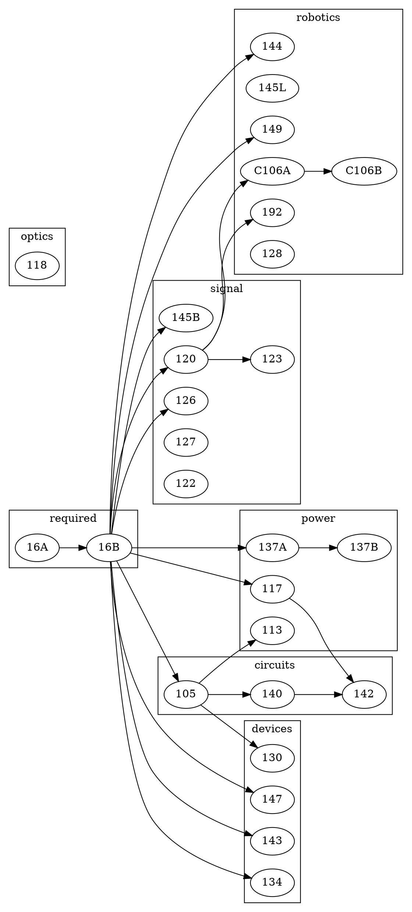
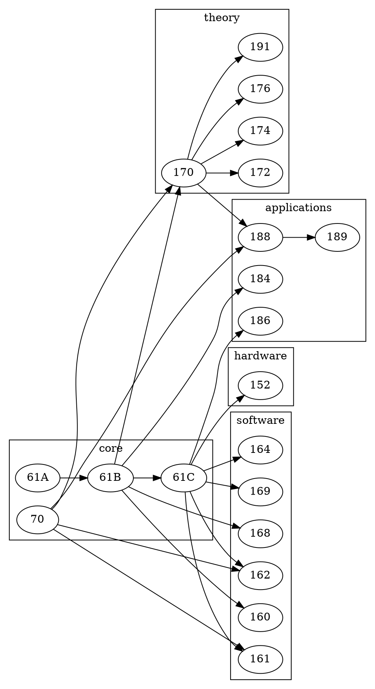

## 学科编码
| 学科体系 | 编码 | 备注 |
| ---- | ---- | ---- |
| UC Berkeley | EECS | https://hkn.eecs.berkeley.edu/courseguides |

## 课程列表与路线图

### UC Berkeley体系EECS课程列表

#### EE

| 编号 | 课程名称 | 类别 | 备注 |
| ---- | ---- | ---- | ---- |
| 16A | Designing Information Devices And Systems I | required | |
| 16B | Designing Information Devices And Systems II | required | |
| 144 | Fundamental Algorithms For Systems Modeling, Analysis, And Optimization | robotics | |
| 145L | Introductory Electronic Transducers Laboratory | robotics | |
| C106A | Introduction To Robotics | robotics | |
| C106B | Robotic Manipulation And Interaction | robotics | |
| 149 | Introduction To Embedded Systems | robotics | |
| 192 | Mechatronic Design Laboratory | robotics | |
| 128 | Feedback Control Systems | robotics | |
| 120 | Signals And Systems | signals | |
| 123 | Digital Signal Processing | signals | |
| 126 | Probability And Random Processes | signals | |
| 122 | Introduction To Communication Networks | signals | |
| 127 | Optimization Models In Engineering | signals | |
| 145B | Medical Imaging Signals And Systems | signals | |
| 117 | Electromagnetic Fields And Waves | power | |
| 113 | Power Electronics | power | |
| 137A | Introduction To Electric Power Systems | power | |
| 137B | Introduction To Electric Power Systems | power | |
| 105 | Microelectronic Devices And Circuits | circuits | |
| 140 | Linear Integrated Circuits | circuits | |
| 142 | Integrated Circuits For Communications | circuits | |
| 130 | Integrated-Circuit Devices | devices | |
| 134 | Fundamentals Of Photovoltaic Devices | devices | |
| 143 | Microfabrication Technology | devices | |
| 147 | Introduction To Microelectromechanical Systems(MEMS) | devices | |
| 118 | Introduction To Optical Engineering | optics | |

#### CS
| 编号 | 课程名称 | 类别 | 备注 |
| ---- | ---- | ---- | ---- |
| 61A | The Structure And Interpretation Of Computer Programs | core | |
| 61B | Data Structures | core | |
| 61C | Machine Structures | core | |
| 70 | Discrete Mathematics And Probability Theory | core | |
| 186 | Introduction To Database Systems | applications | |
| 184 | Foundations Of Computer Graphics | applications | |
| 188 | Introduction To Artificial Intelligence | applications | |
| 189 | Introduction To Machine Learning | applications | |
| 160 | User Interface Design And Development | software | |
| 161 | Computer Security | software | |
| 162 | Operating Systems And System Programming | software | |
| 164 | Programming Languages And Compilers | software | |
| 168 | Introduction To The Internet: Architecture And Protocols | software | |
| 169 | Software Engineering | software | |
| 170 | Efficient Algorithms And Intractable Problems | theory | |
| 172 | Computability And Complexity | theory | |
| 174 | Combinatorics And Discrete Probability | theory | |
| 176 | Algorithms For Computational Biology | theory | |
| 191 | Quantum Information Science And Technology | theory | |
| 152 | Computer Architecture And Engineering | hardware | |

### UC Berkeley体系EECS课程路线图

#### EE

#### CS
