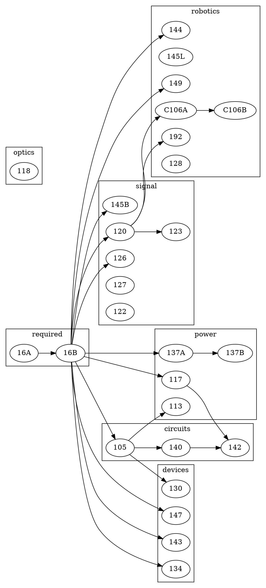

## 学科编码
| 学科体系 | 编码/代号 | 备注 |
| ---- | ---- | ---- |
| UC Berkeley | EECS | https://hkn.eecs.berkeley.edu/courseguides |

## 基础课程
| 课程名称 | 必修/选修 | 备注 |
| ---- | ---- | ---- |
| Design information Devices And Systems | | UC Berkeley 16A |
| Design information Devices And Systems II | | UC Berkeley 16B |

## 专业课程
| 课程名称 | 必修/选修 | 备注 |
| ---- | ---- | ---- |
| Fundamental Algorithms For Systems Modeling, Analysis, And Optimization | | UC Berkeley 144 |
| Introductory Electronic Transducers Laboratory | | UC Berkeley 145L |
| Introduction To Robotics | | UC Berkeley C106A |
| Robotic Manipulation And Interaction | | UC Berkeley C106B |
| Introduction To Embedded Systems | | UC Berkeley 149 |
| Mechatronic Design Laboratory | | UC Berkeley 192 |
| Feedback Control Systems | | UC Berkeley 128 |
| Signals And Systems | | UC Berkeley 120 |
| Digital Signal Processing | | UC Berkeley 123 |
| Probability And Random Processes | | UC Berkeley 126 |
| Introduction To Communication Networks | | UC Berkeley 122 |
| Optimization Models In Engineering | | UC Berkeley 127 |
| Medical Imaging Signals And Systems | | UC Berkeley 145B |
| Electromagnetic Fields And Waves | | UC Berkeley 117 |
| Power Electronics | | UC Berkeley 113 |
| Introduction To Electric Power Systems | | UC Berkeley 137A |
| Introduction To Electric Power Systems | | UC Berkeley 137B |
| Microelectronic Devices And Circuits | | UC Berkeley 105 |
| Linear Integrated Circuits | | UC Berkeley 140 |
| Integrated Circuits For Communications | | UC Berkeley 142 |
| Integrated-Circuit Devices | | UC Berkeley 130 |
| Fundamentals Of Photovoltaic Devices | | UC Berkeley 134 |
| Microfabrication Technology | | UC Berkeley 143 |
| Introduction To Microelectromechanical Systems(MEMS) | | UC Berkeley 147 |
| INTRODUCTION TO OPTICAL ENGINEERING | | UC Berkeley 118 |

## 课程依赖关系

### UC Berkeley体系EE课程关系图

