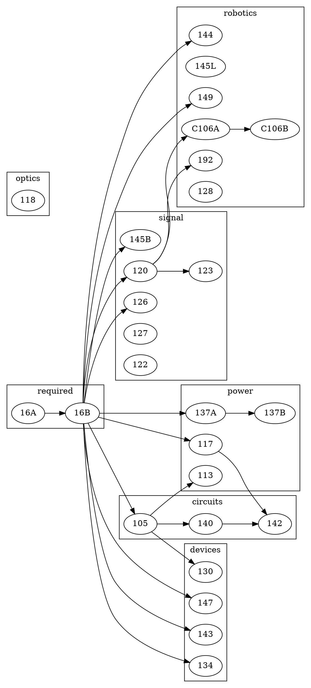

## 学科编码
| 学科体系 | 编码 | 备注 |
| ---- | ---- | ---- |
| UC Berkeley | EECS | https://hkn.eecs.berkeley.edu/courseguides |

## 课程列表与路线图

### UC Berkeley体系EECS课程列表

| 编号 | 课程名称 | 类别 | 备注 |
| ---- | ---- | ---- | ---- |
| 16A | Designing Information Devices And Systems I | required | |
| 16B | DESIGNING INFORMATION DEVICES AND SYSTEMS II | required | |
| 144 | Fundamental Algorithms For Systems Modeling, Analysis, And Optimization | robotics | |
| 145L | Introductory Electronic Transducers Laboratory | robotics | |
| C106A | Introduction To Robotics | robotics | |
| C106B | Robotic Manipulation And Interaction | robotics | |
| 149 | Introduction To Embedded Systems | robotics | |
| 192 | Mechatronic Design Laboratory | robotics | |
| 128 | Feedback Control Systems | robotics | |
| 120 | Signals And Systems | signals | |
| 123 | Digital Signal Processing | signals | |
| 126 | Probability And Random Processes | signals | |
| 122 | Introduction To Communication Networks | signals | |
| 127 | Optimization Models In Engineering | signals | |
| 145B | Medical Imaging Signals And Systems | signals | |
| 117 | Electromagnetic Fields And Waves | power | |
| 113 | Power Electronics | power | |
| 137A | Introduction To Electric Power Systems | power | |
| 137B | Introduction To Electric Power Systems | power | |
| 105 | Microelectronic Devices And Circuits | circuits | |
| 140 | Linear Integrated Circuits | circuits | |
| 142 | Integrated Circuits For Communications | circuits | |
| 130 | Integrated-Circuit Devices | devices | |
| 134 | Fundamentals Of Photovoltaic Devices | devices | |
| 143 | Microfabrication Technology | devices | |
| 147 | Introduction To Microelectromechanical Systems(MEMS) | devices | |
| 118 | INTRODUCTION TO OPTICAL ENGINEERING | optics | |

### UC Berkeley体系EECS课程路线图

