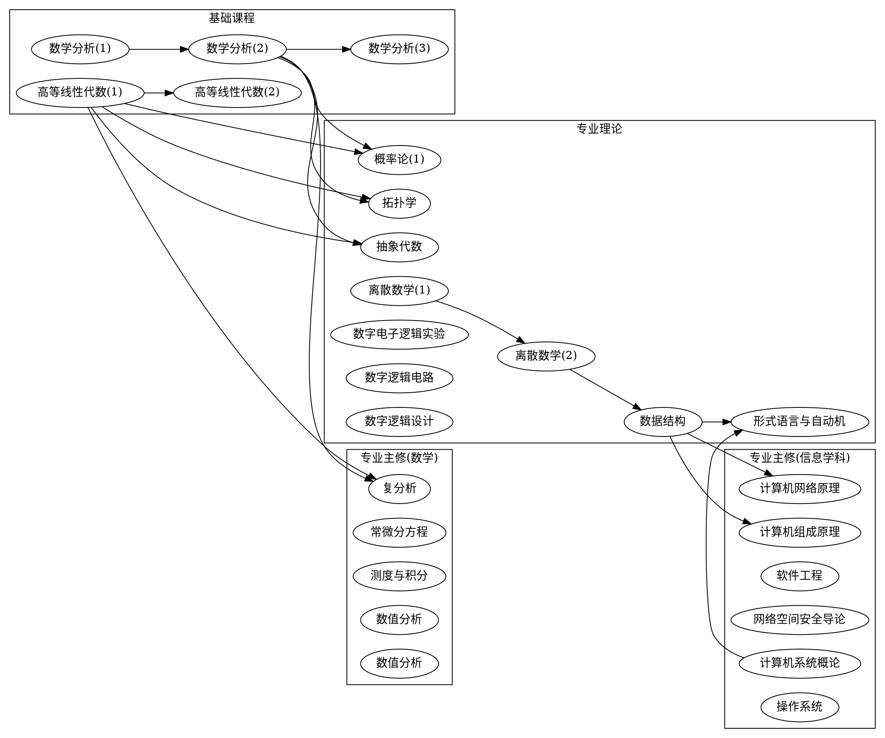
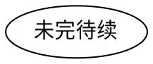

## 学科编码
| 体系 | 编码/代号 | 备注 |
| ---- | ---- | ---- |
| [中国](../../subject_system/china) | 070102 | |
| 清华大学 | 信息与计算科学 | [信息与计算科学专业本科培养方案(2021)](https://www.zlc.tsinghua.edu.cn/info/1084/1396.htm) |
| 北京大学 | 信息与计算科学 | [北京大学本科培养方案（2021）理科卷](http://www.dean.pku.edu.cn/userfiles/upload/download/202108301409468355.pdf) |

## 课程列表与路线图

### 清华大学信息与计算科学课程列表
| 编号 | 课程名称 | 类别 | 备注 |
| ---- | ---- | ---- | ---- |
| 30420405 | [数学分析(1)](../../course/数学分析) | 基础课程 | |
| 10420935 | [数学分析(2)](../../course/数学分析) | 基础课程 | |
| 30420424 | [数学分析(3)](../../course/数学分析) | 基础课程 | |
| 20420124 | [高等线性代数(1)](../../course/高等代数) | 基础课程 | |
| 20420134 | [高等线性代数(2)](../../course/高等代数) | 基础课程 | |
| 30420384 | 抽象代数 | 专业理论基础课 | |
| 40420624 | 概率论(1) | 专业理论基础课 | |
| 30420364 | 拓扑学 | 专业理论基础课 | |
| 20240013 | 离散数学(1) | 专业理论基础课 | |
| 20240023 | 离散数学(2) | 专业理论基础课 | |
| 30240184 | 数据结构 | 专业理论基础课 | |
| 40240432 | 形式语言与自动机 | 专业理论基础课 | |
| 30240551 | 数字电子逻辑实验 | 专业理论基础课 | |
| 30240343 | 数字逻辑电路 | 专业理论基础课(选修) | 二选一 |
| 30240353 | 数字逻辑设计 | 专业理论基础课(选修) | 二选一 |
| 30420464 | 复分析 | 专业主修课程(数学) | |
| 30420484 | 常微分方程 | 专业主修课程(数学) | |
| 30420334 | 测度与积分 | 专业主修课程(数学) | |
| 40420534 | 数学规划 | 专业主修课程(数学) | |
| 20240033 | 数值分析 | 专业主修课程(数学) | 二选一 |
| 40420534 | 数值分析 | 专业主修课程(数学) | 二选一 |
| 40240513 | 计算机网络原理 | 专业主修课程(信息学科) | |
| 40240354 | 计算机组成原理 | 专业主修课程(信息学科) | |
| 30240163 | 软件工程 | 专业主修课程(信息学科) | |
| 30240573 | 网络空间安全导论 | 专业主修课程(信息学科) | |
| 30240593 | 计算机系统概论 | 专业主修课程(信息学科) | |
| 30240243 | 操作系统 | 专业主修课程(信息学科) | |

### 清华大学信息与计算科学课程路线图

### 北京大学信息与计算科学课程列表
| 编号 | 课程名称 | 类别 | 备注 |
| ---- | ---- | ---- | ---- |
| 04831410 | 计算概论 B | 公共必修课 | |
| 04831420 | 数据结构与算法 B | 公共必修课 | |
| 00132301 | [数学分析Ⅰ](../../course/数学分析) | 专业基础课 | |
| 00132302 | [数学分析Ⅱ](../../course/数学分析) | 专业基础课 | |
| 00132321  | [高等代数Ⅰ](../../course/高等代数) | 专业基础课 | |
| 00132323  | [高等代数Ⅱ](../../course/高等代数) | 专业基础课 | |
| 00132304 | [数学分析Ⅲ](../../course/数学分析) | 专业核心课 | |
| 00132341 | 几何学 | 专业核心课 | |
| 00135450 | 抽象代数 | 专业核心课 | |
| 00132320 | 复变函数 | 专业核心课 | |
| 00132340 | 常微分方程 | 专业核心课 | |
| 00131300 | 概率论 | 专业核心课 | |
| 00130200 | 数学模型 | 专业核心课 | |
| 00131670 | 应用数学导论 | 专业核心课 | |
| 00137170 | 机器学习基础 | 专业核心课 | |
| 00130550 | 数值代数 | 专业必选(计算数学) | |
| 00130560 | 数值分析 | 专业必选(计算数学) | |
| 00130630 | 最优化方法 | 专业必选(计算数学) | |
| 00132370 | 实变函数 | 专业限选(计算数学) | |
| 00132330 | 偏微分方程 | 专业限选(计算数学) | |
| 00132350 | 泛函分析 | 专业限选(计算数学) | |
| 00135520 | 偏微分方程数值解 | 专业限选(计算数学) | |
| 00113690 | 随机模拟方法 | 专业限选(计算数学) | |
| 00136720 | 大数据分析中的算法 | 专业限选(计算数学) | |
| 00130640 | 流体力学引论 | 专业限选(计算数学) | |
| 00100873 | 图像处理中的数学方法 | 专业限选(计算数学) | |
| 00112780 | 应用偏微分方程 | 专业限选(计算数学) | |
| 00100883 | 计算系统生物学 | 专业限选(计算数学) | |
| 00110820 | 计算流体力学 | 专业限选(计算数学) | |
| 00110860 | 并行计算Ⅱ | 专业限选(计算数学) | |
| 00110950 | 人工智能 | 专业必选(信息科学) | |
| 00135040 | 程序设计技术与方法 | 专业必选(信息科学) | |
| 00130030 | 信息科学基础 | 专业限选(信息科学) | |
| 00130730 | 数理逻辑 | 专业限选(信息科学) | |
| 00135290 | 集合论与图论 | 专业限选(信息科学) | |
| 00130210 | 计算机图形学 | 专业限选(信息科学) | |
| 00135590 | 计算机图像处理 | 专业限选(信息科学) | |
| 00137170 | 机器学习基础 | 专业限选(信息科学) | |
| 00135050 | 理论计算机科学基础 | 专业限选(信息科学) | |
| 00110060 | 算法设计与分析 | 专业限选(信息科学) | |
| 00130830 | 数字信号处理 | 专业限选(信息科学) | |
| 00130630 | 最优化方法 | 专业限选(信息科学) | |
| 00137960 | 统计思维 | 专业限选(信息科学) | |

### 北京大学信息与计算科学课程路线图
