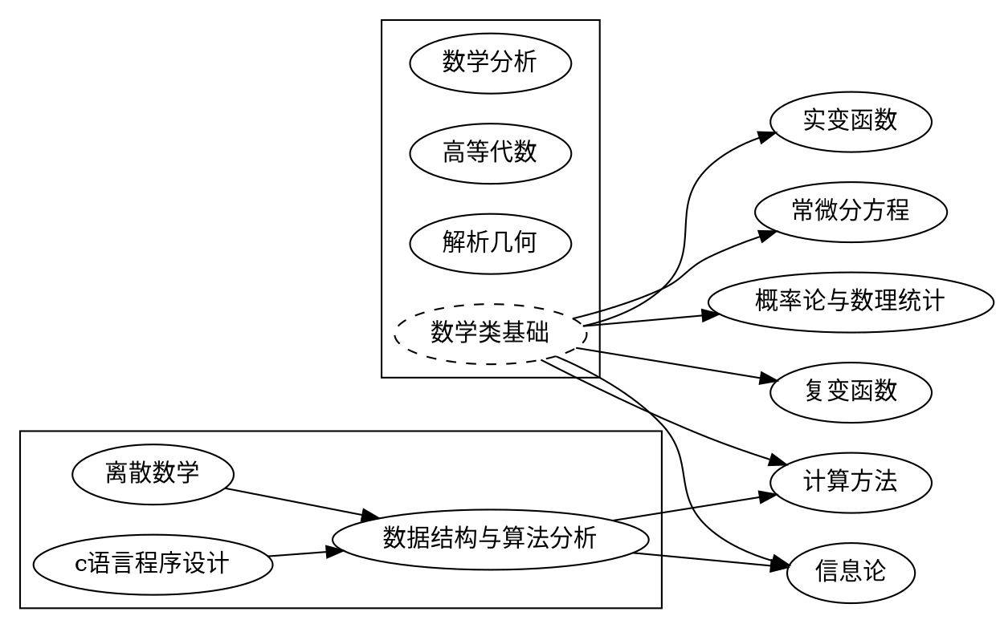

## 学科编码
| 学科体系 | 编码 |
| ---- | ---- |
| [中国](../../subject_system/china) | 070102 |

## 基础课程
| 课程名称 | 必修/选修 | 备注 |
| ---- | ---- | ---- |
| [数学分析](../../course/数学分析) | 必修 | |
| [高等代数](../../course/高等代数) | 必修 | |
| [解析几何](../../course/解析几何) | 必修 | |
| [c语言程序设计](../../course/c语言程序设计) | 必修 | |

## 专业课程
| 课程名称 | 必修/选修 | 备注 |
| ---- | ---- | ---- |
| [离散数学](../../course/离散数学) | 必修 | |
| [数据结构与算法分析](../../course/数据结构与算法分析) | 必修 | |
| [复变函数](../../course/复变函数) | 必修 | |
| [常微分方程](../../course/常微分方程) | 必修 | |
| [实变函数](../../course/实变函数) | 必修 | |
| [概率论与数理统计](../../course/概率论与数理统计) | 必修 | |
| [信息论](../../course/数学建模) | 必修 | |
| [计算方法](../../course/计算方法) | 选修 | |
| [数学建模](../../course/数学建模) | 选修 | |

## 课程依赖关系

