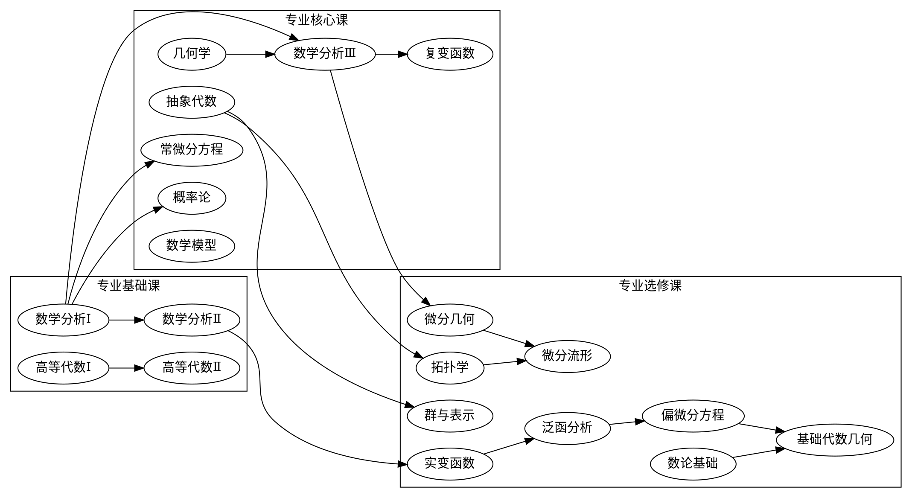

## 学科编码
| 体系 | 编码/代号 | 备注 |
| ---- | ---- | ---- |
| [中国](../../subject_system/china) | 070101 | |
| 北京大学 | 数学与应用数学 | [北京大学本科培养方案（2021）理科卷](http://www.dean.pku.edu.cn/userfiles/upload/download/202108301409468355.pdf) |

## 课程列表与路线图

### 北京大学数学与应用数学课程列表
| 编号 | 课程名称 | 类别 | 备注 |
| ---- | ---- | ---- | ---- |
| 00132301 | [数学分析Ⅰ](../../course/数学分析) | 专业基础课 | |
| 00132302 | [数学分析Ⅱ](../../course/数学分析) | 专业基础课 | |
| 00132321  | [高等代数Ⅰ](../../course/高等代数) | 专业基础课 | |
| 00132323  | [高等代数Ⅱ](../../course/高等代数) | 专业基础课 | |
| 00132304 | [数学分析Ⅲ](../../course/数学分析) | 专业核心课 | |
| 00132341 | [几何学](../../course/解析几何) | 专业核心课 | |
| 00135450 | [抽象代数](../../course/抽象代数) | 专业核心课 | |
| 00132320 | 复变函数 | 专业核心课 | |
| 00132340 | 常微分方程 | 专业核心课 | |
| 00131300 | 概率论 | 专业核心课 | |
| 00130200 | 数学模型 | 专业核心课 | |
| 00131670 | 应用数学导论 | 专业核心课 | |
| 00130161 | 拓扑学 | 专业选修课(基础数学) | |
| 00132310 | 微分几何 | 专业选修课(基础数学) | |
| 00132370 | 实变函数 | 专业选修课(基础数学) | |
| 00130190 | 微分流形 | 专业选修课(基础数学) | |
| 00136870 | 群与表示 | 专业选修课(基础数学) | |
| 00132350 | 泛函分析 | 专业选修课(基础数学) | |
| 00136880 | 数论基础 | 专业选修课(基础数学) | |
| 00132330 | 偏微分方程 | 专业选修课(基础数学) | |
| 00136890 | 基础代数几何 | 专业选修课(基础数学) | |
| 00132830 | 金融数学引论 | 专业必选(金融数学) | |
| 00135460 | 数理统计 | 专业必选(金融数学) | |
| 00133090 | 应用随机过程 | 专业必选(金融数学) | |
| 00132370 | 实变函数 | 专业限选(金融数学) | |
| 00134330 | 金融经济学 | 专业限选(金融数学) | |
| 00136760 | 金融数据分析导论 | 专业限选(金融数学) | |
| 00135810 | 寿险精算 | 专业限选(金融数学) | |
| 00131280 | 证券投资学 | 专业限选(金融数学) | |
| 00136730 | 衍生证券基础 | 专业限选(金融数学) | |
| 00131100 | 金融时间序列分析 | 专业限选(金融数学) | |
| 00132350 | 泛函分析 | 专业限选(金融数学) | |
| 00133010 | 测度论 | 专业限选(金融数学) | |
| 00137110 | 应用随机分析 | 专业限选(金融数学) | |

### 北京大学数学与应用数学课程路线图
#### 基础数学方向

#### 金融数学方向

```graphviz
digraph {
    # 专业基础课 nodes    
    c00132301 [label="数学分析Ⅰ"];
    c00132302 [label="数学分析Ⅱ"];
    c00132321 [label="高等代数Ⅰ"];
    c00132323 [label="高等代数Ⅱ"];

    # 专业基础课 cluster
    subgraph cluster_base {
        c00132301; c00132302; c00132321; c00132323;
        label="专业基础课";
    }

    # 专业核心课 nodes
    c00132304 [label="数学分析Ⅲ"];
    c00132341 [label="几何学"];
    c00135450 [label="抽象代数"];
    c00132320 [label="复变函数"];
    c00132340 [label="常微分方程"];
    c00131300 [label="概率论"];
    c00130200 [label="数学模型"];

    # 专业核心课 cluster
    subgraph cluster_core {
        c00132304; c00132341; c00135450; c00132320; c00132340; c00131300; c00130200;
        label="专业核心课";
    }

    # 专业选修课 nodes
    c00132830 [label="金融数学引论"];
    c00135460 [label="数理统计"];
    c00133090 [label="应用随机过程"];
    c00132370 [label="实变函数"];
    c00134330 [label="金融经济学"];
    c00136760 [label="金融数据分析导论"];
    c00135810 [label="寿险精算"];
    c00131280 [label="证券投资学"];
    c00136730 [label="衍生证券基础"];
    c00131100 [label="金融时间序列分析"];
    c00132350 [label="泛函分析"];
    c00133010 [label="测度论"];
    c00137110 [label="应用随机分析"];

    # 专业选修课 cluster
    subgraph cluster_po {
        c00132830; c00135460; c00133090; c00132370; c00134330; c00136760; c00135810; c00131280; c00136730; c00131100; c00132350; c00133010; c00137110;
        label="专业选修课";
    }

    ##### 专业基础课 dependency #####
    # 数学分析Ⅱ
    c00132301->c00132302;

    # 高等代数Ⅱ
    c00132321->c00132323;

    ##### 专业核心课 dependency #####
    # 数学分析Ⅲ
    c00132301->c00132304;
    c00132341->c00132304;

    # 复变函数
    c00132304->c00132320;

    # 概率论
    c00132301->c00131300;

    # 常微分方程
    c00132301->c00132340;

    ##### 专业选修课 dependency #####
}
```
